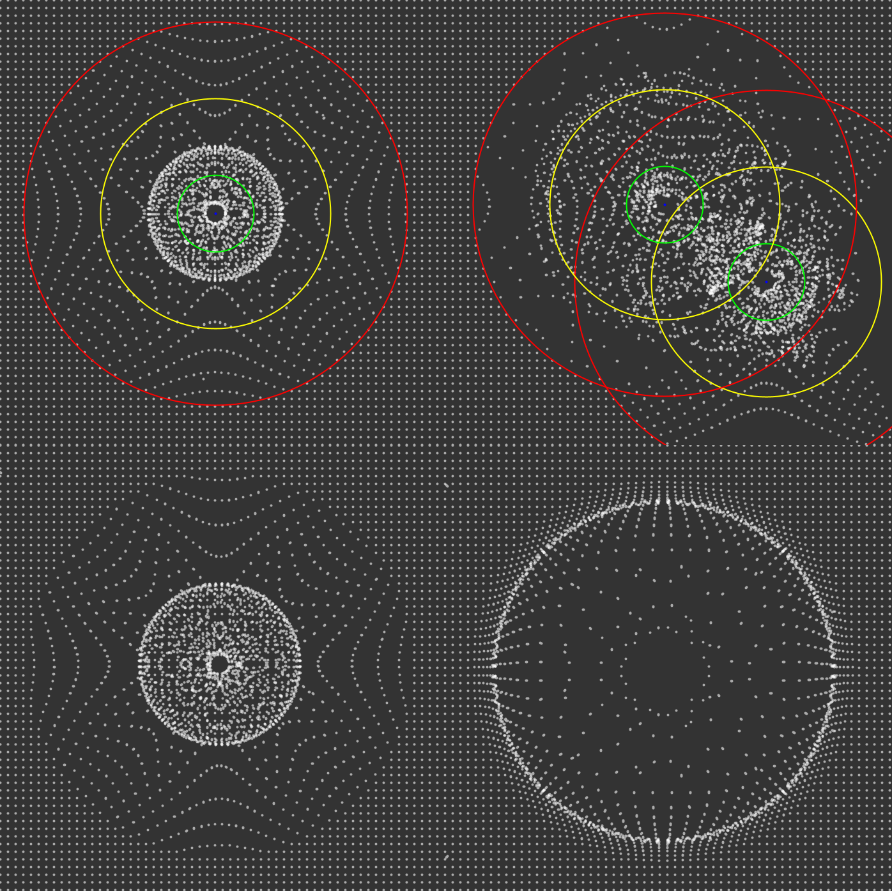
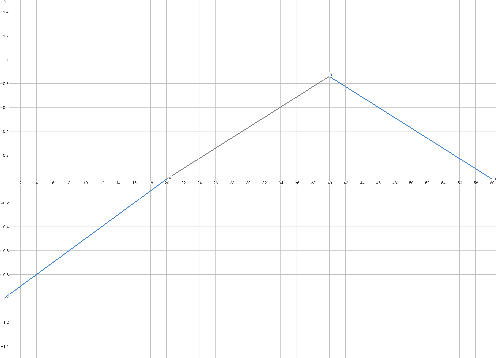

# my-sketch

A Quil sketch designed to give a basic understanding and basis on attraction and repulsion forces.

## Usage

Run `lein run` on the terminal with [Leiningen](https://leiningen.org/) installed.

Left-click on the mouse to add an attractor or repeller, depending on $f_{max}$.

Press space to take a picture. It will be available on `generated/image.png`.

## Examples

## Explanation
The code is based on particles and attractors (or repellers) of same mass equal to 1. 

Using the Gravitational Force Formula,
$$
\vec{F_g} = G\frac{m_1m_2}{r^2}
$$
you get $\vec{F_g} = \frac{G}{r^2}$ for same masses.

Using Newton 2nd law, you get $\vec{F} = m \cdot \vec{a}$, but since $m = 1$, $\vec{F} = \vec{a}$.
Thus,
$$
\vec{a} = \frac{G}{r^2}
$$

For the future repo "Particle Life", based on [this video](https://www.youtube.com/watch?v=p4YirERTVF0), I wanted to manipulate the acceleration in a way it repeals when the distance is two short ($d_{min}$) and attracts when is distant until a threshold ($d_{max}$).

The linear system which does that is the following:

$$
\begin{cases}
u(x) = -1, \text{ } )-\infty, -1( \\
f(x) = \frac{x}{r_{min}} -1, \text{ } (-1, r_{min}( \\
g(x) = \frac{2f_{max}x}{r_{max}-r_{min}} - \frac{2f_{max}r_{min}}{r_{max}-r_{min}}, \text{ }(r_{min}, \frac{r_{max} + r_{min}}{2}( \\
h(x) = \frac{2f_{max}x}{r_{min}-r_{max}} - \frac{2f_{max}r_{max}}{r_{min}-r_{max}}, \text{ }(r_{min}, \frac{r_{max} + r_{min}}{2}, r_{max}) \\
d(x) = 0, \text{ } ) 0, +\infty(
\end{cases}
$$

## About

This is one of the first projects I am developing in Clojure. 

I have used [Quil](http://quil.info/) to create the visuals.

If you wish to contribute, I suggest to optimize calculations using GPU with libraries such as [ClojureCUDA](https://clojurecuda.uncomplicate.org/) or [Neanderthal](https://neanderthal.uncomplicate.org/).
